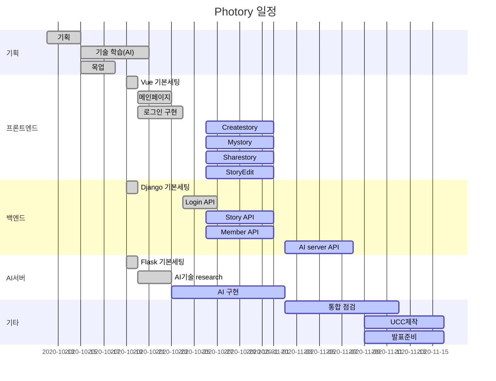

# 📕 Photory

AI 기반 동화책 자동생성 서비스

<br>

## 📆 프로젝트 개요

- **진행 기간**: 2020.10.12 ~ 
- **목표**
  - 사진의 업로드를 통해서 간단하게 이쁜 동화책을 생성하는 웹 서비스 개발
- **계획서**
  - <a href="documentation/계획서/(SSAFY)자율 프로젝트 계획서 양식_A205.pdf">계획서</a>

<br>

## 🐤 프로젝트 소개

 추후 정리

<br>

## 🔧 Tech Stack

<details>
    <summary>Front</summary>
    <ul>
        <li>Vue CLI</li>
        <li>Vuex</li>
        <li>Vuetify</li>
    </ul>
</details>

<details>
    <summary>Back</summary>
    <ul>
        <li>Django</li>
		<li>Flask</li>
        <li>Swagger</li>
        <li>EC2</li>
    </ul>
</details>

<br>

## 📝프로젝트 사용법

Photory 시작 방법입니다.

### Frontend

1. Install NPM packages

```bash
cd vue_client
npm i
```

2. Run server

```
npm run server
```

<br>

### Backend

1. 가상환경 실행 후 진행
2. Install packages

```bash
# 가상환경 먼저 실행 후 진행
cd django_server
pip install -r requirements.txt
```

3. Migration 진행

```
python manage.py makemigrations
python manage.py migrate
```

4. Run server

```
python manage.py runserver
```

<br>

### AI server

1. 가상환경 실행 후 진행
2. Install packages

```bash
# 가상환경 먼저 실행 후 진행
cd flask_server
pip install -r requirements.txt
```

3. Run server

```
python ai_server.py
```

<br>

## ERD

- [ERD 클라우드 주소](https://www.erdcloud.com/d/XM57mdPw6JPgRRYFn)

<br>

## ✨주요 기능

추후 정리

<br>

## 🕛Gantt


<br>

## 🌊 Git flow
### commit

- ```bash
  이슈번호/브랜치이름 : 내용 (형식자유)
  ```
  
- ```bash
  ex)
  S0234165-1/hotfix : Update README.md
  ```
<br>

### branch

​	 master

​			|

​	  develop

​			|

​	각각 기능단위
<br>
<br>

## 🤙Coding Convention
### Front End
* 언어는 javascript를, 프레임워크로 Vue를 사용하기 때문에 기본적으로 javascript와 Vue의 style guide를 따릅니다.

다음은 Vue의 style guide를 요약한 것입니다.
```
1. 컴포넌트명은 최소한 두 단어 이상의 조합으로 짓는다.
2. 데이터는 반드시 함수여야한다.
3. Props는 최대한 자세하게, 최소한 타입이라도 명시해야 한다.
4. v-for는 반드시 key와 함께 사용한다.이 때, key로는 object의 id를 사용하는 것이 좋다.
5. v-for와 v-if는 함께 사용하지 않는다. 새로운 computed 프로퍼티로 대체하여 사용한다.
6. App/Layout 스타일을 제외한 컴포넌트는의 스타일은 스코핑한다. Vue의 scoped나 BEM을 활용한 스코핑
7. 함수를 private하게 유지하기 위해서는 모듈 스코핑을 사용하라. 그것이 불가능하다면 $_yourPlugin_<함수명>을 사용하라.
```


### Back End
* 언어는 python을, 프레임워크로 django를 사용하기 때문에 기본적으로 python과 django의 style guide를 따릅니다.

다음은 django의 style guide를 요약한 것입니다.
```
1. Template stlye 에서 {{ foo }} 와 같이 중괄호 사이에는 space가 하나 들어간다.
2. View stytle에서 'def my_view(request, foo):' 와 같이 반드시 함수의 첫번째 인자의  이름은 request로 한다.
3. Model style에서 반드시 field name은 소문자로 한다.
```

<br>

## 👨‍👩‍👦‍👦팀원

##### **이다현**

- 🐶Github: [@DahyeonL](https://github.com/DahyeonL)

##### **김선민**

- 🐱Github:[@tyhtm3](https://github.com/tyhtm3)

##### **최현우**  

- 🐭Github: [@pica-git](https://github.com/pica-git)

##### **황수현**

- 🐹Blog: [@황수현](https://황수현.site/)

##### **방소윤**

- 🐰Github: [@bbangso](https://github.com/bbangso)

<br>

## 🎞 최종산출물

추후 첨부