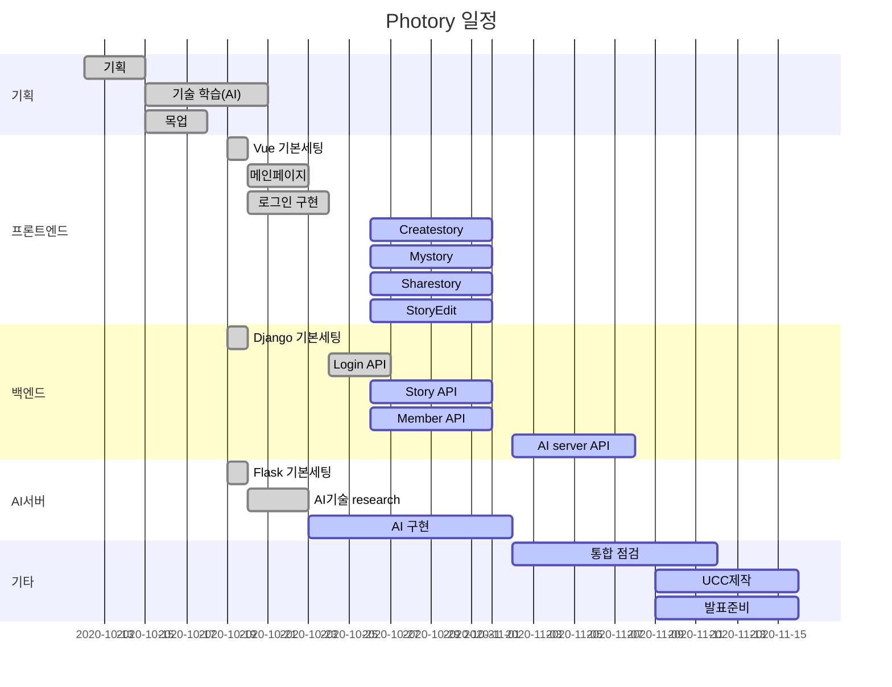

 <-만들면 업데이트

# 📕 Photory

AI 기반 동화책 자동생성 서비스

<br>

## 📆 프로젝트 개요

- **진행 기간**: 2020.10.12 ~ 
- **목표**
  - 사진의 업로드를 통해서 간단하게 이쁜 동화책을 생성하는 웹 서비스 개발
- **계획서**
  - <a href="documentation/계획서/(SSAFY)자율 프로젝트 계획서 양식_A205.pdf">계획서</a>

<br>

## 🐤 프로젝트 소개

 추후 정리

<br>

## 🔧 Tech Stack

<details>
    <summary>Front</summary>
    <ul>
        <li>Vue CLI</li>
        <li>Vuex</li>
        <li>Vuetify</li>
    </ul>
</details>

<details>
    <summary>Back</summary>
    <ul>
        <li>Django</li>
		<li>Flask</li>
        <li>Swagger</li>
        <li>EC2</li>
    </ul>
</details>

<br>

## 📝프로젝트 사용법

Photory 시작 방법입니다.

### Frontend

1. Install NPM packages

```bash
cd vue_client
npm i
```

2. Run server

```
npm run server
```

<br>

### Backend

1. 가상환경 실행 후 진행
2. Install packages

```bash
# 가상환경 먼저 실행 후 진행
cd django_server
pip install -r requirements.txt
```

3. Migration 진행

```
python manage.py makemigrations
python manage.py migrate
```

4. Run server

```
python manage.py runserver
```

<br>

### AI server

1. 가상환경 실행 후 진행
2. Install packages

```bash
# 가상환경 먼저 실행 후 진행
cd flask_server
pip install -r requirements.txt
```

3. Run server

```
python ai_server.py
```

<br>

## ERD

- [ERD 클라우드 주소](https://www.erdcloud.com/d/XM57mdPw6JPgRRYFn)

<br>

## ✨주요 기능

추후 정리

<br>

## 🕛Gantt




## 👨‍👩‍👦‍👦팀원

##### **이다현**

- 🐶Github: [@DahyeonL](https://github.com/DahyeonL)

##### **김선민**

- 🐱Github:[@tyhtm3](https://github.com/tyhtm3)

##### **최현우**  

- 🐭Github: [@pica-git](https://github.com/pica-git)

##### **황수현**

- 🐹Blog: [@황수현](https://황수현.site/)

##### **방소윤**

- 🐰Github: [@bbangso](https://github.com/bbangso)

<br>

## 🎞 최종산출물

추후 첨부