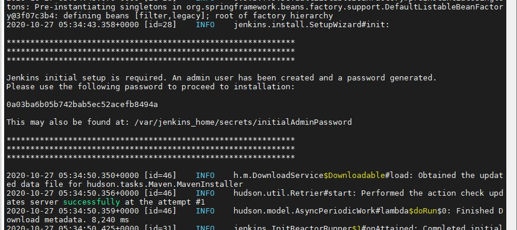
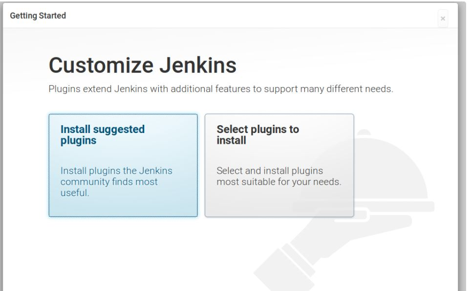

***
# Default Jenkins Setting

## Dev
#### Flatform
AWS(ubuntu18.04)

#### VM
Docker


***
## Docker 설치 <sup id="a1">[1](#f1)</sup>
###### 1. 이번 버전의 도커 관련 패키지들을 삭제한다

```bash
sudo apt-get remove docker docker-engine docker.io containerd runc
```


><b id="f1"><sup>1</sup></b> 참고 : https://docs.docker.com/engine/install/ubuntu/[↩](#a1)<br>


###### 2. 도커 엔진 설치

최신 버전 설치
```bash
sudo apt-get update
sudo apt-get install docker-ce docker-ce-cli containerd.io
```

특정 버전 설치
```bash
apt-cache madison docker-ce

  docker-ce | 5:18.09.1~3-0~ubuntu-xenial | https://download.docker.com/linux/ubuntu  xenial/stable amd64 Packages
  docker-ce | 5:18.09.0~3-0~ubuntu-xenial | https://download.docker.com/linux/ubuntu  xenial/stable amd64 Packages
  docker-ce | 18.06.1~ce~3-0~ubuntu       | https://download.docker.com/linux/ubuntu  xenial/stable amd64 Packages
  docker-ce | 18.06.0~ce~3-0~ubuntu       | https://download.docker.com/linux/ubuntu  xenial/stable amd64 Packages
  ...
sudo apt-get install docker-ce=<VERSION_STRING> docker-ce-cli=<VERSION_STRING> containerd.io
```

***

## Jenkins 설치
###### 1. Docker를 통한 Jenkins 이미지 받기

```bash
docker pull jenkins/jenkins:lts
```


###### 2. Jenkins 이미지를 컨테이너로 실행


```bash
docker run -d -p 8181:8080 -v /jenkins:/var/jenkins_home --name jm_jenkins -u root jenkins/jenkins:lts
// 위 명령어 옵션설명 
-d	detached mode 흔히 말하는 백그라운드 모드
-p	호스트와 컨테이너의 포트를 연결 (포워딩)
-v	호스트와 컨테이너의 디렉토리를 연결 (마운트)
–name	컨테이너 이름 설정
-u 실행할 사용자 지정

맨 마지막 jenkins/jenkins:lts 는 실행할 이미지의 레포지토리 이름이며 만약 이미지가 없을 경우 이미지를 docker hub 에서 땡겨오므로 주의한다.
```


###### 3. k3a205.p.ssafy.io:8181로 접속해서 추가설치를 한다.

처음에 접속하면 Admin password를 요구한다. __/var/jenkins_home/secrets/initialAdminPassword__를 통해 확인한다.
혹은
```bash
sudo docker logs [컨테이너 이름]
```
을 통해서도 확인가능하다.

######
sudo docker logs의 내용


패스워드를 페이지에서 입력하면 플러그인 설치 창이 나온다.
######

Install suggested plugins를 선택하면 기본적인 플러그인들을 설치한다.

플러그인 설치 후 초기 계정을 생성하고 접속한다.


###### 4. Jenkins에 접속하여 두 가지 플러그인(gitlab, publish over SSH)를 더 설치한다. 설치는 Jenkins 관리 - 플러그인 관리 에서 할 수 있다.
######

######

######

검색은 설치 가능 탭에서 검색하여 설치한다.


###### 5. nginx를 시작하거나 재시작한다.


###### 6. 도메인에 접속하여 확인한다.
