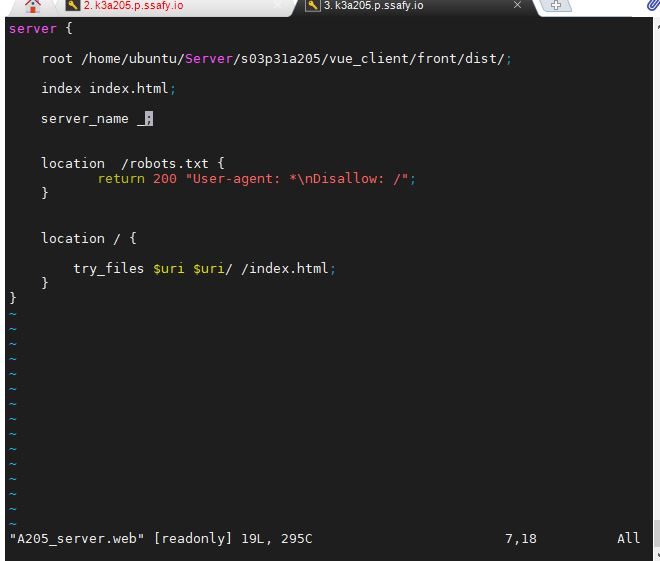

***

# Default Deployment Setting

## Dev
#### Deployment Server
AWS 

#### FrontEnd
Vue

***

## Install
###### 1. 기본적으로 npm, nodejs 설치가 필요. nodejs를 설치하면 npm는 자동으로 설치된다. 여기서는 nvm을 이용해 npm 최신버전을 다룬다.

nvm(노드 버전 관리자)를 설치
```bash
curl -o- https://raw.githubusercontent.com/creationix/nvm/v0.32.0/install.sh | bash
```

nvm 활성화
```bash
. ~/.nvm/nvm.sh
```

npm 버전 확인
```bash
nvm ls-remote
```

npm 설치 <!-- 2020.10.22일자 LTS 최신 버전-->

```bash
nvm install 12.19.0 
```

nodejs 버전 확인<sup id="a1">[1](#f1)</sup>
```bash
node -v
```
npm 버전 확인
```bash
npm -v
```

><b id="f1"><sup>1</sup></b> 최신 버전인지 확인하는 것은 중요하다. 프로젝트는 최신 버전에서 정상 작동한다.[↩](#a1)<br>


###### 2. nginx 설치

```bash
sudo apt-get install nginx
```

###### 3. 프론트 가져오기 및 빌드

git에서 배포하고자할 프로젝트 clone
```bash
git clone https://lab.ssafy.com/s03-final/s03p31a205.git
```

폴더 이동
```bash
cd s03p31a205/vue_client/front
```

패키지 설치 및 빌드
```bash
npm install
npm run build
```

***

## Deploy
###### 1. 빌드 파일 경로 확인. build를 실행시킨 폴더에 dist 폴더가 npm run build한 결과이다.

__/home/ubuntu/Server/s03p31a205/vue_client/front/dist/__

###### 2. /etc/nginx/ 폴더로 이동. sites-available 폴더로 이동하여 설정 파일을 생성한다.

#### 설정 파일 폴더 구조
```bash
**sites-available**  : 가상 서버 환경들에 대한 설정 파일들이 위치하는 부분. 가상 서버를 사용하거나 사용하지 않던간에 그에 대한 설정 파일들이 위치하는 곳
**sites-enabled** : sites-available에 있는 가상 서버 파일들중에서 실행시키고 싶은 파일을 symlink로 연결한 폴더. 실제로 이 폴더에 위치한 가상서버 환경 파일들을 읽어서 서버를 세팅한다.
**nginx.conf** : Nginx에 관한 설정파일로 Nginx 설정에 관한 블록들이 작성되어 있으며 이 파일에서 sites-enabled 폴더에 있는 파일들을 가져온다. (include 명령어를 사용).
```


```bash
cd /etc/nginx/
cd ./sites-available
touch A205_server.web
vim A205_server.web
```

sites-available 폴더에는 기본적으로 default 파일이 있을 것이다. 그 파일을 수정해도 되지만 여기서는 다른 설정 파일을 생성해서 사용한다.




root 에는 빌드한 파일의 경로를 설정
index는 index 파일의 파일명을 지정
server_name은 서버이름을 지정하는 곳으로 기본적으로 {도메인 네임 혹은 아이피} 형식을 따른다. 여기서 _로 지정한 이유는 서버 기본 도메인으로 접속하는 모든 호스트에게 제공한다는 뜻이다. 도메인 네임을 지정하게 되면 지정한 도메인으로 접속하는 호스트에게 지정된 페이지를 제공할 수 있다.

location /robots.txt - 크롤링을 막아준다. 검색 엔진에 노출되지 않는 설정

location / - 모든 사용자들에게 먼저 index.html을 제공해준다.


###### 3. /etc/nginx/sites-enabled 폴더로 이동하여 심볼릭 링크를 생성한다. 이 심볼릭 링크가 있어야만 sites-available에 있는 설정파일을 사용유무가 결정되는 것이다.

```bash
cd ../sites-enabled
ln -s ../sites-available/A205_server.web A205_server.web
```

###### 4. nginx.conf를 열어 생성한 설정 파일을 이용하여 배포할 수 있도록 수정한다.


Virtual Host Configs 부분의 include를 통해 배포할 설정파일을 선택할 수 있다.
site-enabled 폴더의 심볼릭링크 파일을 포함시켜야 sites-available 폴더에 있는 설정 파일을 읽는다.


###### 5. nginx를 시작하거나 재시작한다.

nginx 시작
```bash
sudo systemctl start nginx
```

nginx 재시작
```bash
sudo systemctl restart nginx
```

++ nginx 중지
```bash
sudo nginx -s stop
```

###### 6. 도메인에 접속하여 확인한다.

http://k3a205.p.ssafy.io/
