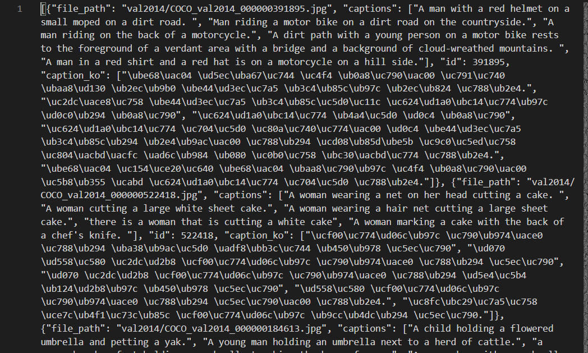

# StoryGenerationKoGPT2

### 파일 구조

```sh
ms_coco_eval.ipynb : 이미지에 대한 이미지 캡셔닝 수행
mc_coco_modeling.ipynb : 이미지 캡셔닝 모델링 프로그램
train_captions.pickle : 학습된 캡션을 담고 있는 파일
```

## 1. 소개

[Image captioning with visual attention](https://www.tensorflow.org/tutorials/text/image_captioning?hl=en)를 이용하여 이미지 학습을 한 후 이미지에 맞는 캡션을 생성해냅니다. 데이터는 [MS-COCO](https://cocodataset.org/#download) val2014, train2014 이미지를 사용했으며 캡션은 [aihub](https://aihub.or.kr/keti_data_board/visual_intelligence)의 한국어 이미지 설명 데이터셋을 사용했습니다.

## 2. 이미지 캡셔닝 모델

구글 드라이브 링크 : https://drive.google.com/drive/folders/1Vp5WR5XFmgc1Fnpc7N6HU4MUhvCNaXfO?usp=sharing

## 3. Install

Development Setting

```sh
python == 3.7.5
pip == 20.2.4
cuda == 10.1 update2
cudnn == 7.6.5 + 8.0.2  ## 우선 7.6.5버젼을 cuda 라이브러리에 넣은 후 8.0.2버젼을 다운받아서 cuda 라이브러리에 넣는다.
```

```sh
pip install matplotlib sklearn pickle

```

## 4. 이미지 캡셔닝 모델 생성

ms_coco_modeling.ipynb의 annotation_file 변수에 이미지에 대한 캡션을 담고 있는 파일을 가져온다.
[MS-COCO](https://cocodataset.org/#download) 사이트에서 제공하는 영문 캡션이랑 [aihub](https://aihub.or.kr/keti_data_board/visual_intelligence)에서 제공하는 한국어+영문 캡션의 데이터 형식 조금씩 다르고 aihub의 데이터는 val 캡션과 train 캡션을 합쳐놓은 것이므로 다른 방법으로 데이터를 가져와야한다.
이 소스의 코드는 한글 캡션에 최적화된 코드로서 [aihub](https://aihub.or.kr/keti_data_board/visual_intelligence)의 데이터 형식은 다음과 같다.



annotation_file 변수에 json으로 된 캡션 파일 경로를 넣고 val2014.zip와 train2014.zip을 다운 받은 후 이 폴더에 압축을 풀어준 후 실행한다. 학습된 모델은 checkpoints 폴더에 저장되며 학습할 캡션인 train_captions도 pickle로 파일을 생성해 보관한다.

## 5. 이미지에 캡션 달기

먼저 ms_coco_eval.py의 파라미터를 조정한다. 각 파라미터들은 학습했을 때의 값과 같은 값이 요구된다.

```sh
max_length # 학습한 캡션의 갯수, 학습 이미지의 갯수랑 동일
top_k  ## 학습한 단어의 최대 수
embedding_dim ## 임베딩 차원 수
units
vocab_size = top_k + 1
features_shape = 2048
attention_features_shape = 64
checkpoint_path ## 학습한 모델의 폴더를 지정한다.
image_url ## 캡션을 달고자하는 사진의 url를 지정한다.

with open('$checkpoint_path/train_captions.pickle','rb') as fr:
    train_captions = pickle.load(fr)   ## 학습한 캡션 데이터를 가져온다.
```

checkpoint_path로 지정된 경로에는 다음과 같은 파일이 있어야 한다.

```sh
checkpoint
ckpt-xx.data-00000-of-00001
ckpt-xx.index
train_captions.pickle

```

필요한 요건을 갖춘 후 ms_coco_eval.py 를 실행시켜 캡션을 생선한다.

## 6. 라이센스

modified MIT 라이센스

## 7. 참조

- [Image captioning with visual attention](https://www.tensorflow.org/tutorials/text/image_captioning?hl=en)
